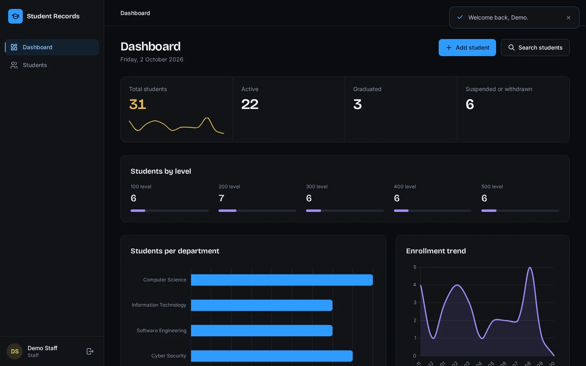
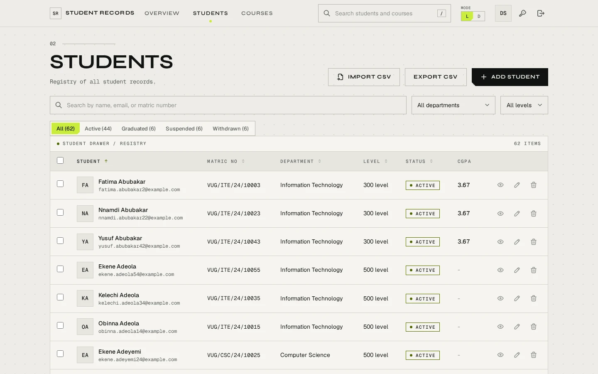
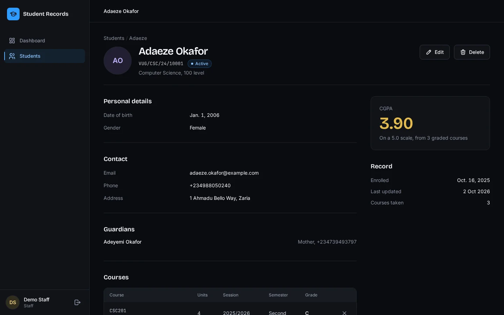

# Student Management System

A Django CRUD capstone project: staff manage student records and students sign in to see their own record. It is built as a portfolio piece, so the interface is polished, the code is tested, and the README documents how everything fits together.

## Screenshots

| Dashboard | Student list |
|---|---|
|  |  |

| Student detail |
|---|
|  |

## Features

- Home page, login page, and dashboard with stat cards, charts, and recent activity
- Add, edit, delete, and detail views for students, with guardians managed inline
- Live search, filters, sorting, and pagination on the student list, powered by HTMX
- Course enrollments with grades and an automatically computed CGPA
- Role-based access for admin, staff, and student accounts
- Audit log of every create, update, and delete, with the actor recorded
- Student self-service record page at `/me/`
- Admin panel, custom 403 and 404 pages, seeded demo data, and a styled component set

## Tech stack

Python 3.12, Django 5, SQLite (PostgreSQL via `DATABASE_URL`), Tailwind CSS through `django-tailwind`, HTMX, Chart.js, WhiteNoise, Pillow, django-environ, coverage.

Why Tailwind instead of Bootstrap: the design is a dark, token-driven interface with a custom palette, and Tailwind expresses it directly in the markup without fighting a Bootstrap theme. The palette, fonts, and component classes are defined once in `theme/static_src/src/styles.css` and reused everywhere.

## Setup

Requires Python 3.12 and Node 20 or newer.

```bash
git clone <repository-url>
cd student-management-system
python -m venv .venv
source .venv/bin/activate
pip install -r requirements.txt
cp .env.example .env
python manage.py migrate
python manage.py seed_demo
python manage.py tailwind install
```

## Run

In one terminal build and watch the CSS:

```bash
python manage.py tailwind start
```

In another terminal run the app:

```bash
python manage.py runserver
```

Open http://127.0.0.1:8000.

## Demo accounts

Run `python manage.py seed_demo` first. Passwords come from environment variables; the documented defaults below are for local use only.

| Role | Username | Password (local default) |
|---|---|---|
| Admin | `demo_admin` | `LocalAdmin20!` |
| Staff | `demo_staff` | `LocalStaff20!` |
| Student | `demo_student` | `LocalStudent20!` |

Set `DEMO_MODE=True` to show the demo account autofill buttons on the login page.

## Live demo

Not deployed yet. The build plan in section 15 covers deployment to a host with an external PostgreSQL database.

## Database

Local development, tests, and the assignment submission run on SQLite, and nothing about the project requires PostgreSQL to be installed. The live demo runs on PostgreSQL, selected only by setting the `DATABASE_URL` environment variable, because hosts like Render have ephemeral disks: a SQLite file on the service disk would be wiped on every redeploy, so the demo would lose every change a visitor made. Uploaded photos follow the same rule: send them to S3-compatible object storage with `USE_S3=True`, or switch uploads off with `PHOTO_UPLOADS=False`. Run `python manage.py clearsessions` now and then to prune expired sessions.

## Architecture

Three Django apps under a `config` project:

- `accounts`: roles (groups plus a `user_role` helper), permission mixins, and the login view that routes each role to its home page
- `students`: models (`Department`, `Student`, `Guardian`, `Course`, `Enrollment`), forms, all student and course views, the `seed_demo` command, and the `ui` template tags
- `core`: home and dashboard views, the `AuditLog` model, audit middleware and signals, and error pages

Every request stores the current user in thread-local storage; post-save and post-delete signals on `Student`, `Course`, and `Enrollment` write audit rows with that user attached. Views stay thin and business logic lives on the models. Queries use `select_related` and `prefetch_related` to avoid N+1 problems. See `SYSTEM_DESIGN_FLOWS.md` for the request flow diagrams.

## Tests

```bash
coverage run manage.py test
coverage report
```

The suite covers the CGPA calculation, the permission matrix for every role, form validation, HTMX behavior, CRUD flows, audit logging, dashboard counts, and the seeding command. Coverage summary:

```
TOTAL   793   47   94%
```

## Known limitations

- Photos are stored locally in development; on ephemeral hosts use object storage or disable uploads
- The enrollment trend chart counts students by `enrolled_on`, not course enrollments
- There is no self-service password reset or user management UI; users are managed in the admin panel
- The student list paginates server-side; the live search re-renders the table partial, not individual cells
- First request after a free-tier host idles can be slow while the service wakes up
